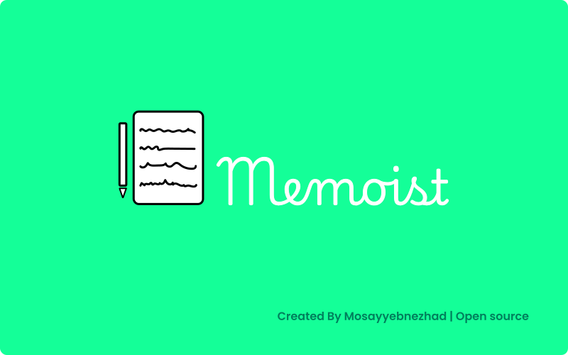

# memoist

the ultimate app designed to help you keep track of your tasks, appointments, and important notes with ease. Whether you're managing a busy schedule or simply need a reliable tool to remember everyday details, Memoist is here to ensure you never miss a beat.



This is a sample portfolio website built using React. It showcases my skills , projects, and experience.

## Figma
This project was designed in Figma before starting.

[Memoist](https://www.figma.com/Unknown!) on Figma

## Table of Contents

- [Demo](#demo)
- [Features](#features)
- [Installation](#installation)
- [Usage](#usage)
- [Technologies Used](#technologies-used)
- [Contributing](#contributing)
- [License](#license)
- [Contact](#contact)

## Demo

You can check out the live demo of the website [here](https://Unknown!).

## Features

- Responsive design
- Projects showcase
- Skills display
- Contact form
- Clean and modern UI

## Installation

To get a local copy up and running follow these simple steps:

1. **Clone the repository**

```bash
- git clone https://github.com/mosayyebnezhad/Memoist

- npm i
```
